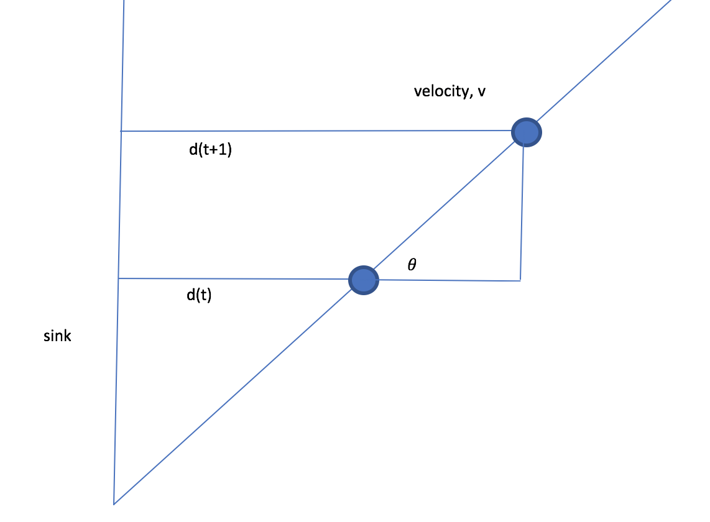

# Extended Kalman Filter

Applied EKF on a simple example of a bug moving at an angle from the sink at a constant velocity.

The state of the System is a vector consisting of 3 elements. 
1. Lateral distance of the bug from the sink.
2. The angle at which it is moving
3. The velocity of the bug.

The velocity and the angle is constant, the only parameter changing is the lateral distance of the bug from the sink and the task is to estimate that.

The lateral distance is a function of previous lateral distance, the velocity and the cosine of the angle which in all makes the system non-linear. So we have to use EKF and not KF.

Since the equations are non-linear, we need to calculate Jacobian based on the three equations of the state.

And since the only parameter to be predicted is the lateral distance, the H matrix will be a 1x3 matrix with first value 1 and rest 0s.

As in figure, the blue dot is the bug moving at a constant angle and velocity.

 
References:

[Simple Example of Applying Extended Kalman Filter](https://www.researchgate.net/publication/273381901_Simple_Example_of_Applying_Extended_Kalman_Filter?enrichId=rgreq-e2f865965156e5c797628f76986b5d07-XXX&enrichSource=Y292ZXJQYWdlOzI3MzM4MTkwMTtBUzoyMDU2NzkyOTkxNzQ0MDlAMTQyNjA0OTE3NDY1MQ%3D%3D&el=1_x_2&_esc=publicationCoverPdf)
 
[Kalman Filter: Predict, Measure, Update, Repeat](https://medium.com/@tjosh.owoyemi/kalman-filter-predict-measure-update-repeat-20a5e618be66)
